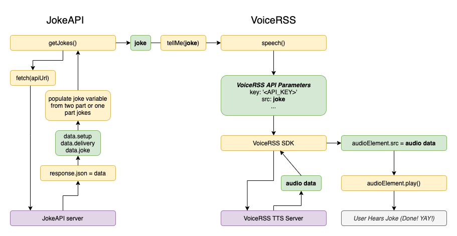

# Joke Teller

## Description
This project is a simple web application that tells jokes to users upon request. Users can click a button to trigger the joke-telling functionality, and the application will deliver a random joke using audio narration. The project utilizes VoiceRSS for text-to-speech conversion and leverages HTML, CSS, and JavaScript for the user interface and functionality.

## Features
- Tells random jokes upon user request.
- Utilizes audio narration for joke delivery.
- Responsive design for various devices.

## Technologies Used
- HTML
- CSS
- JavaScript
- VoiceRSS API
- Font Awesome (for icon styling)

## Joke Teller FlowChart

## Usage
1. Clone the repository to your local machine.
2. Open the `index.html` file in a web browser.
3. Click the "Tell Me A Joke" button to hear a joke.

## Additional Notes
- Ensure an active internet connection for the audio playback to function properly.
- The `favicon.png` file serves as the website's favicon.
- Styles are defined in the `style.css` file.
- Joke-telling functionality is implemented in the `script.js` file.
- The `voiceRSS.js` file contains functions for utilizing the VoiceRSS API.

## JavaScript Code Explanation
The JavaScript code included in the project serves the following purposes:
- It retrieves a random joke from the Joke API and plays it using text-to-speech functionality provided by VoiceRSS.
- The `toggleButton` function is used to disable/enable the "Tell Me A Joke" button to prevent multiple clicks while a joke is being told.
- The `tellMe` function passes the retrieved joke to the VoiceRSS API for text-to-speech conversion.
- The `getJokes` function fetches a joke from the Joke API, formats it, and triggers the text-to-speech functionality.
- Event listeners are added to the button to initiate joke retrieval and to the audio element to re-enable the button once the joke playback ends.

## Credits
- Font Awesome for icon styling.
- VoiceRSS for text-to-speech functionality.

## License
This project is licensed under the [MIT License](LICENSE).
